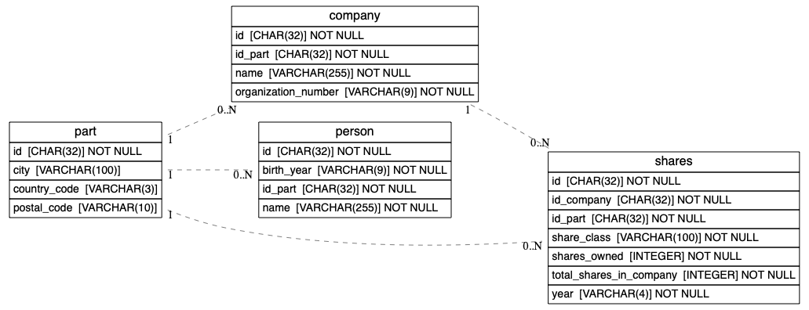

# Shareholder Registry Database
Longitudinal database for Aksjonærregisteret: https://www.skatteetaten.no/deling/aksjonarregisteret/

This repository contains 

## Setup
- database: postgres
- engine: SQLModel
- infra: terraform + podman


## Infrastructure-as-Code
The infrastructure is defined with terraform under the folder `/infrastructure`. 

## Building & Deploying the application 
You can build the application and the deploy to podman with two commands:
```bash
make deploy # build the image and register to podman
make tf-deploy # deploy the application container and the postgresdb
```
Check the [Makefile](Makefile) if you want to look into the details.

## Datamodel

